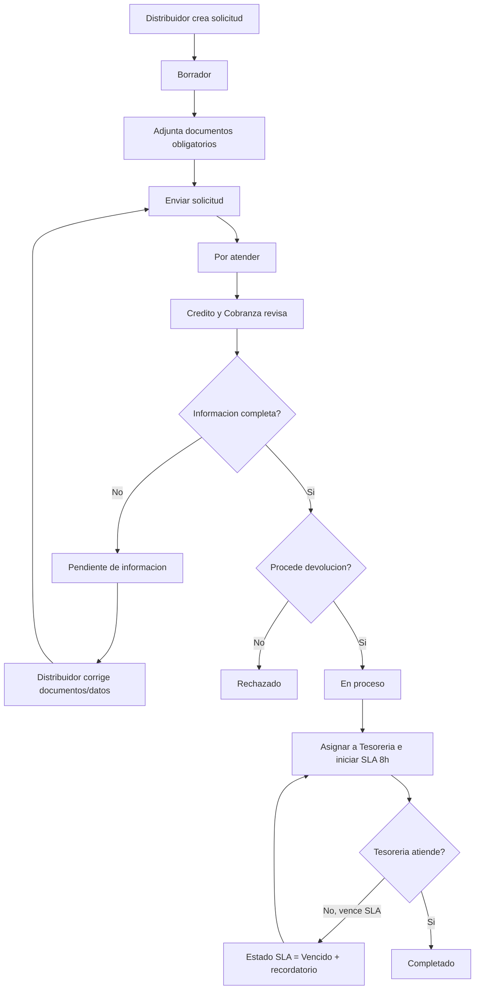

# CC1 - Proceso de Solicitudes de Devolucion

Documento de handoff para agentes/colaboradores como Claude, Gemini o Codex.

Rama base de trabajo: `codex/cc1-devoluciones-alineacion-proceso`

Objeto principal: `CAZ_SolicitudDevolucion__c`

Este documento explica como esta resuelto hoy el proceso de devoluciones, que decisiones de arquitectura se tomaron y que adecuaciones faltan para alinearlo con el flujo funcional acordado.

## Objetivo funcional

El proceso debe permitir que un distribuidor solicite una devolucion desde el portal, adjunte documentos obligatorios, y que Credito y Cobranza revise la solicitud antes de enviarla a Tesoreria para la gestion bancaria.

El usuario de portal no debe editar directamente el estatus. Debe trabajar por acciones de negocio:

- Guardar borrador
- Enviar solicitud
- Corregir informacion
- Reenviar solicitud
- Consultar avance

Los usuarios internos controlan el avance operativo:

- Credito y Cobranza revisa, solicita informacion, rechaza de forma final o envia a Tesoreria.
- Tesoreria atiende la devolucion bancaria y completa el proceso.

## Modelo recomendado de estatus

El estatus funcional objetivo para `CAZ_Status__c` debe ser:

| Estatus | Uso |
| --- | --- |
| `Borrador` | Captura inicial del distribuidor. Editable desde portal. |
| `Por atender` | Solicitud enviada y pendiente de revision por Credito y Cobranza. |
| `Pendiente de informacion` | Credito y Cobranza solicito correcciones o documentos. El distribuidor puede corregir y reenviar. |
| `En proceso` | Solicitud procedente, enviada a Tesoreria/provision/JDE/banco. |
| `Rechazado` | Rechazo final de negocio. No debe confundirse con falta de informacion. |
| `Completado` | Devolucion bancaria concluida y notificada. |
| `Cancelado` | Solicitud cancelada o abandonada. |

Hoy el org usa estos valores:

- `Borrador`
- `Por atender`
- `Aprobado`
- `Rechazado`
- `Solicitud Completada`
- `En revision Tesoreria` inactivo

Adecuacion pendiente: reemplazar semanticamente `Aprobado` por `En proceso`, agregar `Pendiente de informacion` y `Cancelado`, y normalizar `Solicitud Completada` a `Completado` si negocio lo aprueba.

## SLA

El SLA de Tesoreria no deberia depender solo del estatus. La recomendacion es separar:

- `CAZ_Status__c`: estado del proceso.
- `CAZ_EstadoSLA__c`: estado del SLA.

Valores sugeridos para `CAZ_EstadoSLA__c`:

- `No iniciado`
- `En tiempo`
- `Vencido`
- `Cumplido`

Hoy existe `CAZ_SiguienteRecordatorio__c`, usado para programar recordatorios cada 8 horas habiles cuando la solicitud esta en `Aprobado`.

Archivos actuales relacionados:

- `force-app/main/default/objects/CAZ_SolicitudDevolucion__c/fields/CAZ_SiguienteRecordatorio__c.field-meta.xml`
- `force-app/main/default/flows/CAZ_Recordatorio_Aprobado_Devolucion.flow-meta.xml`
- `force-app/main/default/classes/CAZ_NotificarTesoreriaAprobado.cls`

Adecuacion pendiente: ajustar la condicion del recordatorio de `Aprobado` a `En proceso`, y marcar el SLA como `Vencido` cuando corresponda.

## Flujo objetivo

## Componentes actuales

### Objeto

`CAZ_SolicitudDevolucion__c`

Archivo:

- `force-app/main/default/objects/CAZ_SolicitudDevolucion__c/CAZ_SolicitudDevolucion__c.object-meta.xml`

Configuracion actual relevante:

- `enableHistory = true`
- `enableFeeds = true`
- `enableReports = true`
- `externalSharingModel = Private`
- `sharingModel = ReadWrite`

Observacion: el sharing externo privado ayuda al portal, pero el sharing interno `ReadWrite` puede ser demasiado abierto si el proceso requiere control por queues/areas.

### Campos actuales

Campos existentes en el objeto:

- `CAZ_Account__c`
- `CAZ_Comentarios__c`
- `CAZ_ComprobanteReferencia__c`
- `CAZ_Description__c`
- `CAZ_ImporteDevolucion__c`
- `CAZ_MotivoDevolucion__c`
- `CAZ_MotivoRechazo__c`
- `CAZ_NombreCreador__c`
- `CAZ_NumeroCuentaBancaria__c`
- `CAZ_OtroMotivoRechazo__c`
- `CAZ_Respuesta__c`
- `CAZ_SiguienteRecordatorio__c`
- `CAZ_Status__c`

Campos recomendados faltantes:

- `CAZ_EstadoSLA__c`
- `CAZ_FechaEnvioCC__c`
- `CAZ_FechaSolicitudInformacion__c`
- `CAZ_MotivoSolicitudInformacion__c`
- `CAZ_FechaReenvio__c`
- `CAZ_NumeroReenvios__c`
- `CAZ_FechaEnvioTesoreria__c`
- `CAZ_FechaAtencionTesoreria__c`
- `CAZ_NumeroProvisionJDE__c`
- `CAZ_ReferenciaBancaria__c`
- `CAZ_FechaPago__c`

### Portal

Componentes LWC principales:

- `force-app/main/default/lwc/cazPortalSubmitSolicitud`
- `force-app/main/default/lwc/cazMisSolicitudes`
- `force-app/main/default/lwc/cazSolicitudDevolucion`
- `force-app/main/default/lwc/cazCargaDocumentos`

Comportamiento actual:

- El portal muestra boton `Enviar solicitud` solo en `Borrador`.
- Al enviar, llama a `CAZ_SolicitudDevolucionController.submitApprovalFromPortal`.
- Ese metodo cambia el estatus de `Borrador` a `Por atender`.
- La carga de documentos se bloquea cuando la solicitud no esta en modo editable.

Adecuacion pendiente:

- Permitir edicion/carga controlada tambien en `Pendiente de informacion`.
- Cambiar el path visual para incluir los estatus objetivo.
- Cambiar las clases visuales de la lista para los nuevos estatus.
- Agregar accion `Reenviar solicitud` cuando el estado sea `Pendiente de informacion`.

### Apex

Archivos principales:

- `force-app/main/default/classes/CAZ_SolicitudDevolucionController.cls`
- `force-app/main/default/classes/CAZ_SolicitudDevolucionTriggerHandler.cls`
- `force-app/main/default/triggers/CAZ_SolicitudDevolucionTrigger.trigger`
- `force-app/main/default/classes/CAZ_NotificarTesoreriaAprobado.cls`
- `force-app/main/default/classes/CAZ_DocumentoSolicitudCtrl.cls`

Responsabilidades actuales:

- `CAZ_SolicitudDevolucionController`
  - Consulta solicitudes del distribuidor por `AccountId`.
  - Envia solicitud desde portal cambiando `Borrador -> Por atender`.

- `CAZ_SolicitudDevolucionTriggerHandler`
  - En `before insert`, asigna `CAZ_Account__c` desde el usuario de portal.
  - En `before update`, valida documentos requeridos cuando cambia `Borrador -> Por atender`.
  - En `before update`, asigna a queue `CreditoCobranza`.
  - En `before update`, cuando el estado cambia a `Aprobado`, asigna a queue `Tesoreria` y calcula `CAZ_SiguienteRecordatorio__c`.
  - En `after update`, envia notificaciones in-app a queues y al creador.
  - Mantiene acceso del creador con share manual cuando cambia el propietario.

- `CAZ_NotificarTesoreriaAprobado`
  - Envia recordatorio a Tesoreria para solicitudes en `Aprobado`.
  - Reprograma el siguiente recordatorio usando Business Hours.

- `CAZ_DocumentoSolicitudCtrl`
  - Lee documentos requeridos desde `CAZ_DocumentoSolicitud__mdt`.
  - Etiqueta archivos usando `ContentVersion.Description`.
  - Lista documentos cargados via `ContentDocumentLink`.
  - Elimina `ContentDocument` desde el componente.

Observaciones:

- El nombre `submitApprovalFromPortal` es confuso porque no somete al Approval Process; solo actualiza estatus.
- La logica de recordatorio sigue usando `Aprobado`.
- La falta de informacion usa indirectamente `Borrador`, lo cual debe cambiar a `Pendiente de informacion`.
- `CAZ_DocumentoSolicitudCtrl` conserva logica para `Case`; ese vestigio deberia retirarse si ya no se usa Case para devoluciones.

### Documentos

Modelo actual:

- Archivos Salesforce Files (`ContentDocument`, `ContentVersion`, `ContentDocumentLink`).
- Tipo de documento guardado en `ContentVersion.Description`.
- Catalogo de documentos via `CAZ_DocumentoSolicitud__mdt`.

Metadata actual relevante:

- `force-app/main/default/customMetadata/CAZ_DocumentoSolicitud.Caratula_Estado_Cuenta.md-meta.xml`
- `force-app/main/default/customMetadata/CAZ_DocumentoSolicitud.Comprobante_Pago.md-meta.xml`
- `force-app/main/default/customMetadata/CAZ_DocumentoSolicitud.Estado_de_cuenta.md-meta.xml`

Adecuacion recomendada:

Crear objeto hijo funcional, por ejemplo `CAZ_DocumentoDevolucion__c`, si se requiere control fino por documento.

Campos sugeridos:

- `CAZ_SolicitudDevolucion__c`
- `CAZ_TipoDocumento__c`
- `CAZ_ContentDocumentId__c`
- `CAZ_EstadoDocumento__c`
- `CAZ_VisiblePortal__c`
- `CAZ_RequiereReemplazo__c`
- `CAZ_ComentarioCC__c`
- `CAZ_ValidadoPor__c`
- `CAZ_FechaValidacion__c`

Estados sugeridos de documento:

- `Pendiente`
- `Cargado`
- `Validado`
- `Requiere reemplazo`
- `Reemplazado`
- `Rechazado`

Si el alcance actual solo necesita validar presencia de documentos, se puede mantener el modelo actual de Files + metadata, pero es limitado para auditoria.

### Automatizaciones declarativas

Componentes actuales:

- `force-app/main/default/approvalProcesses/CAZ_SolicitudDevolucion__c.Solicitud_Devolucion.approvalProcess-meta.xml`
- `force-app/main/default/workflows/CAZ_SolicitudDevolucion__c.workflow-meta.xml`
- `force-app/main/default/flows/CAZ_Alerta_Solicitud_Completada.flow-meta.xml`
- `force-app/main/default/flows/CAZ_Alerta_Solicitud_Rechazada.flow-meta.xml`
- `force-app/main/default/flows/CAZ_Recordatorio_Aprobado_Devolucion.flow-meta.xml`

Riesgo actual:

Hay mezcla de Approval Process, Workflow Rules, Flows y Apex. El portal no esta usando el Approval Process para enviar la solicitud; por eso puede haber una ruta declarativa activa que no represente la experiencia real del portal.

Recomendacion:

- Definir un solo orquestador principal para cambios de estado.
- Para este proceso, se recomienda Apex/Flow controlado por acciones en portal y acciones internas, no Approval Process clasico, salvo que negocio exija aprobaciones formales con historial nativo de aprobacion.
- Si se conserva Approval Process, el portal debe someter realmente con `Approval.process`, no solo cambiar `CAZ_Status__c`.

### Queues

Queues actuales:

- `CreditoCobranza`
- `Tesoreria`

Archivos:

- `force-app/main/default/queues/CreditoCobranza.queue-meta.xml`
- `force-app/main/default/queues/Tesoreria.queue-meta.xml`

Uso actual:

- `CreditoCobranza` recibe solicitudes en `Por atender`.
- `Tesoreria` recibe solicitudes en `Aprobado`.

Adecuacion pendiente:

- Cambiar `Aprobado` por `En proceso` para Tesoreria.

### Permisos

Permission sets actuales revisados:

- `CAZ_Distribuidor`
- `CAZ_EjecutivoCreditoCobranza`
- `CAZ_Admin`
- `System_Administrador`

Hallazgo importante:

Varios permission sets tienen Field Level Security para campos de `CAZ_SolicitudDevolucion__c`, pero sus `objectPermissions` siguen apuntando a `Case`. Esto parece herencia del intento anterior de implementar devoluciones con Case.

Riesgo:

El usuario puede tener FLS pero no CRUD correcto sobre `CAZ_SolicitudDevolucion__c`, dependiendo de otros permisos/perfiles. Esto vuelve fragil el portal y la operacion interna.

Adecuacion pendiente:

- Agregar object permissions explicitamente para `CAZ_SolicitudDevolucion__c`.
- Mantener `CAZ_Status__c` como no editable para distribuidor.
- Definir si los permisos de `Case` deben retirarse del paquete de devoluciones o quedarse por otros procesos ajenos.

## Decision de arquitectura

Decision recomendada para esta rama:

Mantener `CAZ_SolicitudDevolucion__c` como objeto transaccional principal y no volver a `Case`.

Motivos:

- El proceso tiene ciclo financiero propio.
- Requiere documentos, SLA, queues y posible integracion JDE.
- Ya existe objeto custom, portal, trigger, flows y reportes alrededor de `CAZ_SolicitudDevolucion__c`.
- Case fue un intento anterior y ya no es requerido segun direccion funcional.

## Orden sugerido de implementacion

1. Ajustar `CAZ_Status__c` al modelo objetivo.
2. Agregar campos de SLA, fechas y control operativo.
3. Actualizar Apex para transiciones:
   - `Borrador -> Por atender`
   - `Pendiente de informacion -> Por atender`
   - `Por atender -> Pendiente de informacion`
   - `Por atender -> Rechazado`
   - `Por atender -> En proceso`
   - `En proceso -> Completado`
4. Ajustar recordatorios de Tesoreria para `En proceso`.
5. Ajustar portal para editar solo en `Borrador` y `Pendiente de informacion`.
6. Ajustar permisos para `CAZ_SolicitudDevolucion__c`.
7. Decidir si se desactiva o se alinea el Approval Process/Workflow.
8. Agregar pruebas Apex para nuevas transiciones.
9. Si se requiere auditoria funcional, agregar `CAZ_HistorialDevolucion__c`.
10. Si se requiere control fino de documentos, agregar `CAZ_DocumentoDevolucion__c`.

## Reglas de negocio propuestas

Portal:

- Puede crear solicitud.
- Puede editar mientras esta en `Borrador`.
- Puede editar/cargar reemplazos mientras esta en `Pendiente de informacion`.
- No puede editar `CAZ_Status__c`.
- No puede editar cuando esta en `Por atender`, `En proceso`, `Rechazado`, `Completado` o `Cancelado`.

Credito y Cobranza:

- Trabaja solicitudes en `Por atender`.
- Puede pedir informacion, rechazar final o enviar a Tesoreria.
- Debe capturar motivo si cambia a `Pendiente de informacion` o `Rechazado`.

Tesoreria:

- Trabaja solicitudes en `En proceso`.
- Debe capturar referencia/fecha/evidencia bancaria antes de completar.

SLA:

- Inicia cuando la solicitud pasa a `En proceso`.
- Vence a las 8 horas habiles si Tesoreria no atiende.
- Al vencer, enviar recordatorio y marcar `CAZ_EstadoSLA__c = Vencido`.

## Estado actual de esta rama

Esta rama ya contiene el respaldo recuperado del org para devoluciones y este documento de handoff.

Primera tanda aplicada en el objeto:

- `CAZ_Status__c` ya incluye los valores objetivo `Pendiente de informacion`, `En proceso`, `Completado` y `Cancelado`.
- Se conservaron temporalmente los valores legacy `Aprobado` y `Solicitud Completada` porque Apex/Flows/Workflow todavia los referencian.
- Se agrego `CAZ_EstadoSLA__c` para separar el SLA del estado principal.
- Se agregaron campos de fechas/control para CC, informacion adicional, reenvios, Tesoreria, provision JDE, referencia bancaria y fecha de pago.
- Se actualizo el layout interno de solicitud de devolucion para exponer los nuevos campos operativos.
- Se actualizo `CAZ_Devolucion.pathAssistant` para reflejar el flujo objetivo.
- Se amplio `Bloqueo_Edicion_Cerrada` para contemplar `Completado` y `Cancelado`.

Pendiente: ajustar Apex, Flow, Workflow, LWC, permisos y pruebas para usar los nuevos estatus de forma operativa.

Cambios ajenos existentes en el workspace no forman parte de esta rama funcional y no deben mezclarse con devoluciones:

- Cambios de `CAZ_PortalPedidosController.cls`
- Metadata de Order/Account/logistica
- Scripts temporales en `scripts/apex`
- Archivos temporales/debug
